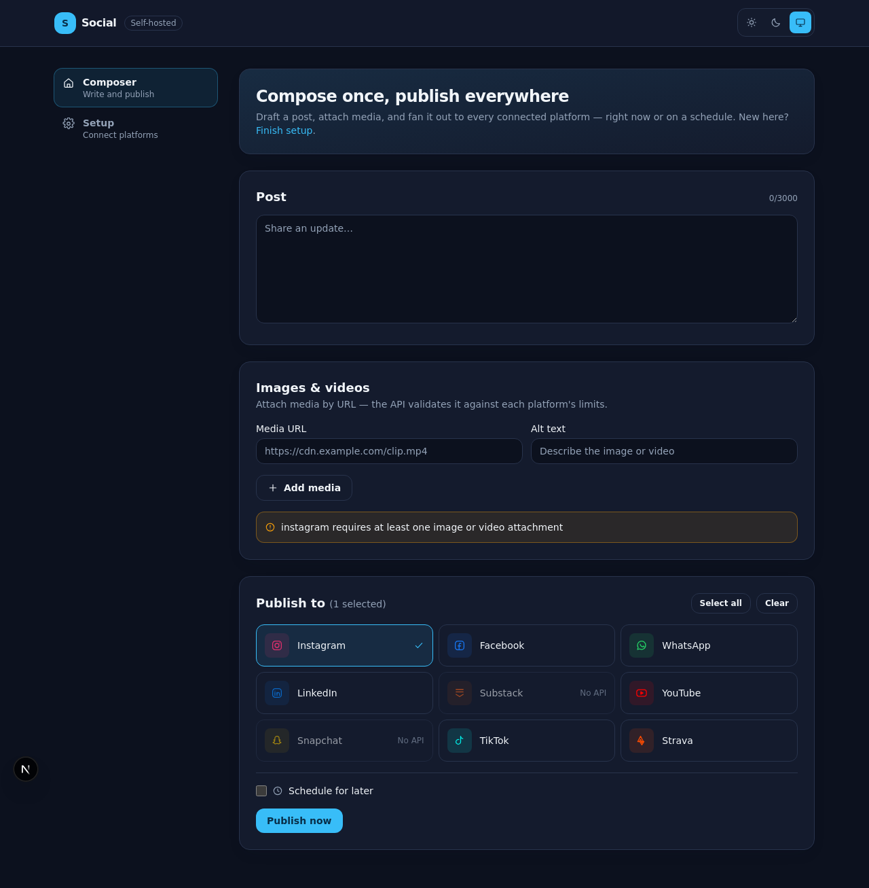
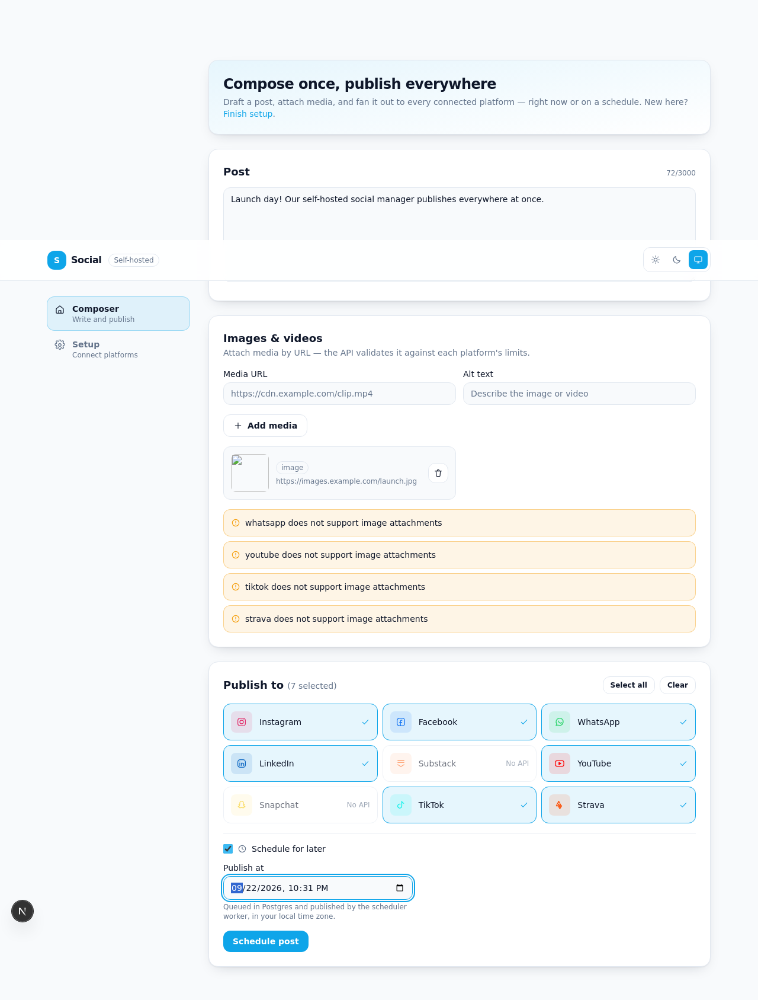

# Social

AGPL-3.0 self-hosted social-media manager with a Next.js dashboard, Fastify API, and MCP server.

**Live demo: https://charles2ke.github.io/social/** — a static export of the
dashboard published automatically from `main` (see "Deploying the demo to
GitHub Pages"). It is UI-only: there is no API or database behind it, so
publishing does nothing.

| Dashboard | Composing a cross-platform post |
| --- | --- |
|  |  |

```text
Web (apps/web) ──► API (apps/api) ──► Core adapters/scheduler (packages/core)
MCP stdio server ───────────────────► Core adapters/scheduler
                                      └── PostgreSQL / Prisma (packages/db)
```

## Quick start

Requirements: Node.js 20+, [pnpm](https://pnpm.io) 9, and Docker.

1. Copy `.env.example` to `.env`, retain `MOCK_MODE=true`, and choose a 32-byte hex `ENCRYPTION_KEY`.
2. Start Postgres: `docker compose up -d postgres` (this also creates the
   least-privilege `social_worker` role automatically — see "Database"
   below).
3. Run `corepack pnpm install`, apply migrations with
   `corepack pnpm db:migrate`, then `corepack pnpm dev`.
4. Open http://localhost:3000. The API runs on port 3001. Use
   `docker compose up --build` to run everything (Postgres + the app) in
   containers with a single command.

Mock mode provides safe demo tokens/accounts and never contacts a platform,
so you get a working end-to-end demo with **no social platform credentials
configured**. Production deployments must use HTTPS, a strong `ADMIN_TOKEN`,
and platform credentials. Tokens are encrypted with AES-256-GCM before
persistence; errors must not include token values.

## Platform integrations

Each platform is a `PlatformSpec` in
[`packages/core/src/adapters`](packages/core/src/adapters) wrapped by
`ApiAdapter`, which handles OAuth, mock mode, per-platform draft overrides,
and token redaction. `fetch` and the environment are injected, so the API
clients are unit-tested without network access.

| Platform | Publishing | Analytics | Notes |
| --- | --- | --- | --- |
| Facebook | Page feed (`/{page-id}/feed`) | Post insights + like/comment counts | Long-lived tokens are exchanged, not refreshed. [Meta apps](https://developers.facebook.com/docs/) |
| Instagram | Media container + `media_publish` | Media insights + counts | Requires media — the API has no text-only post. Needs a Business/Creator account |
| LinkedIn | `ugcPosts` share | Social actions (likes/comments) | Refreshable member tokens. [LinkedIn apps](https://www.linkedin.com/developers/) |
| WhatsApp | Cloud API text message | — | Messages opted-in `WHATSAPP_RECIPIENTS`; the [Cloud API](https://developers.facebook.com/docs/whatsapp/cloud-api) has no broadcast post |
| YouTube | Data API v3 resumable `videos.insert` | Video statistics | Requires a video URL; visibility via `YOUTUBE_PRIVACY_STATUS` |
| TikTok | `/v2/post/publish/video/init/` (`PULL_FROM_URL`) | `/v2/video/query/` | Unaudited apps may only post `SELF_ONLY`; the video URL must be on a verified domain |
| Strava | `POST /api/v3/activities` | — | Strava has no feed post type, so a post becomes an activity |
| Snapchat, Substack | Not supported | — | No public API for publishing organic content; both raise `UnsupportedOperation` |

### Connecting an account

1. Register each platform's OAuth app with the callback
   `BASE_URL/api/oauth/<platform>/callback` and set its client id/secret in
   `.env`.
2. Visit `BASE_URL/api/oauth/<platform>/start`. The API redirects to the
   platform with an HMAC-signed, ten-minute `state` value, so the callback is
   verified statelessly and CSRF is blocked without server-side session state.
3. The callback exchanges the code, reads the platform profile, and stores the
   account with its **AES-256-GCM encrypted** access/refresh tokens (see
   `accounts` and `oauth_tokens` in [`packages/db`](packages/db)). Tokens are
   refreshed automatically five minutes before expiry when publishing.

Platform responses and errors are passed through `redactSecrets` so that
tokens never reach logs or API responses.

### API authentication

Outside mock mode, `ADMIN_TOKEN` is required and every route except `/health`
and the OAuth callback (which is authenticated by its signed `state`) needs
an `Authorization` header carrying `ADMIN_TOKEN` as a bearer token. The API
refuses to start without it.
Because a browser cannot hold that token safely, serve the dashboard behind
your own authenticated proxy when `ADMIN_TOKEN` is set.

## Database

The persistence layer is **PostgreSQL, accessed through Prisma** — see
[`docs/adr/0001-database.md`](docs/adr/0001-database.md) for the full
security/reliability/performance rationale (short version: the DB stores
OAuth refresh tokens for 9 platforms and a background scheduler writes
concurrently with the web app, which is exactly the profile Postgres is
built for).

The Prisma schema, migrations, and scheduler claim-loop live in
[`packages/db`](packages/db).

### Running tests

```bash
pnpm test
```

Each test file in `packages/db` gets its own throwaway Postgres schema
(see `packages/db/test/setup.ts`), so tests can run against any bare
Postgres instance — including the one started by
`docker compose up -d postgres` above — with no hand-provisioned database
or seed data. CI provisions Postgres via a GitHub Actions service
container (see `.github/workflows/ci.yml`).

### Least-privilege worker role

`packages/db/prisma/init/01-social-worker-role.sql` creates a
`social_worker` Postgres role scoped to only what the scheduler needs:
read/write on `posts`, `platform_publish_attempts`, and
`analytics_snapshots`, read-only on `accounts` and `oauth_tokens`, and
nothing else. It's applied automatically by the `postgres` service on
first boot (mounted into `/docker-entrypoint-initdb.d`).

To have the scheduler worker connect using this role instead of the
default superuser, set `WORKER_DATABASE_URL` in `.env` to a connection
string using the `social_worker` role and have the worker process read
that variable instead of `DATABASE_URL`. Give the role a real password
out-of-band in production (`ALTER ROLE social_worker WITH PASSWORD '...'`)
— never commit one.

### Connection pooling

The Next.js app and the MCP server are separate processes and each open
their own Prisma connection pool. `packages/db`'s `createPrismaClient()`
sizes the pool from `DATABASE_CONNECTION_LIMIT` (default 5) — set this
per-consumer in each service's environment.

In production, put [PgBouncer](https://www.pgbouncer.org/) in front of
Postgres and point both consumers at it instead of the database directly.
When PgBouncer runs in transaction pooling mode, append `pgbouncer=true`
to `DATABASE_URL` so Prisma disables features that don't work with
statement-level pooling (see the commented example in `.env.example`).

## MCP

The MCP server shares `@social/core` with the web/API and exposes account,
draft, publishing, scheduling, status, and analytics tools plus
`social://accounts` and `social://posts/{id}` resources.

```json
{ "mcpServers": { "social": { "command": "node", "args": ["/absolute/path/to/social/packages/mcp-server/dist/mcp-server/src/index.js"], "env": { "MOCK_MODE": "true", "ENCRYPTION_KEY": "your-64-hex-character-key" } } } }
```

Use this in `claude_desktop_config.json` or VS Code MCP settings after
`corepack pnpm build`. It includes the `cross_platform_announcement` prompt.
The MCP server publishes with the single `SOCIAL_ACCESS_TOKEN` fallback; it
does not yet read the connected accounts the API stores in Postgres.

## Development

`corepack pnpm lint`, `typecheck`, `test`, and `build` validate all workspaces.
The scheduler persists per-platform results (including errors), and its queue
supports cancellation and retries through the API/MCP surface.

### Deploying the demo to GitHub Pages

`.github/workflows/pages.yml` builds `apps/web` as a static export and
publishes it to GitHub Pages on every push to `main` (and on demand via
*Run workflow*). Enable it once per fork under **Settings → Pages → Build
and deployment → Source: GitHub Actions**.

The export is opt-in: `apps/web/next.config.mjs` only sets Next.js'
`output: "export"` when `NEXT_STATIC_EXPORT=true`, and prefixes assets with
`NEXT_BASE_PATH` (the workflow passes `/<repository>` for project Pages), so
`pnpm dev` and self-hosted deployments keep the normal server build. To
reproduce the published site locally:

```bash
NEXT_STATIC_EXPORT=true NEXT_BASE_PATH=/social corepack pnpm --filter @social/web run build
```

The result lands in `apps/web/out`. Because Pages serves static files only,
the deployed dashboard has no API to call — run the full stack locally or
self-host it for a working install.
